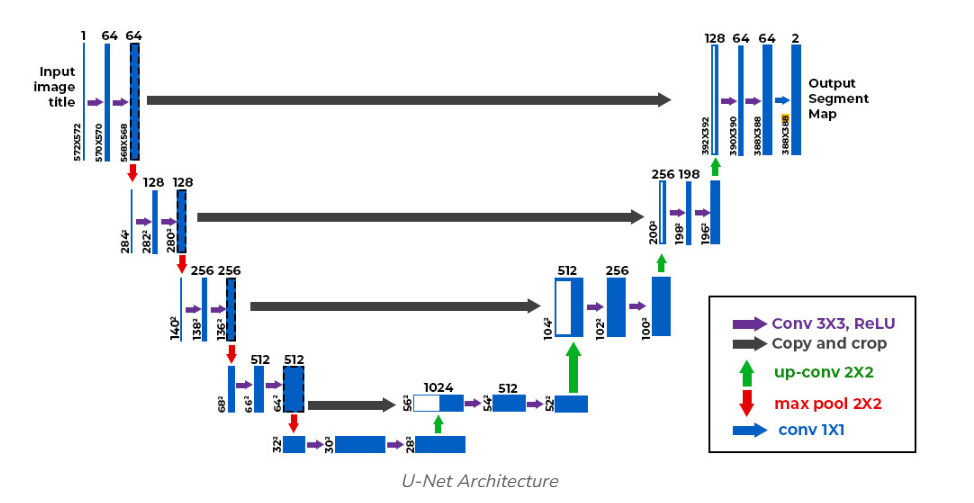
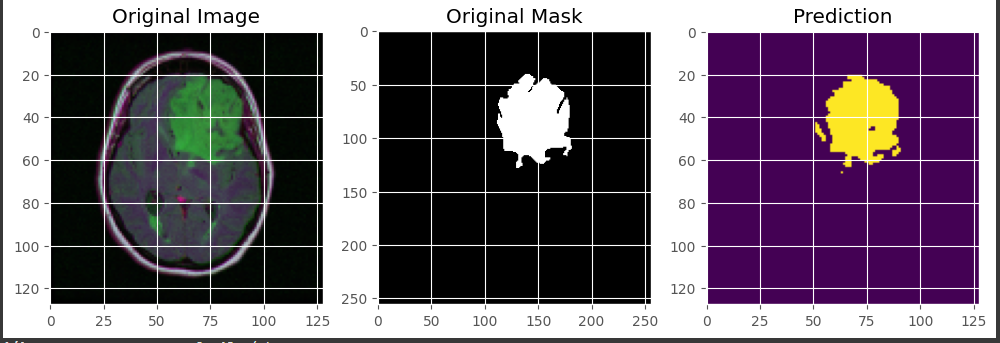

# BrainTumorSegmentation
Brain Tumor Segmentation using U-Net on LGG MRI dataset - A deep learning pipeline built with TensorFlow/Keras for semantic segmentation of brain tumors from MRI images.

This project performs **semantic segmentation** on brain MRI scans using the **U-Net architecture**, identifying and outlining brain tumors. The entire training and evaluation pipeline runs in **Google Colab** — no local setup required.

---

## Dataset

- **Name**: LGG Brain MRI Segmentation Dataset
- **Source**: [Kaggle - mateuszbuda/lgg-mri-segmentation](https://www.kaggle.com/datasets/mateuszbuda/lgg-mri-segmentation)
- **Contents**: Paired MRI slices and segmentation masks

📌 You will need to upload your `kaggle.json` file to authenticate and download the dataset in Colab.

---

##  Model: U-Net

U-Net is a CNN architecture specifically designed for biomedical image segmentation. It consists of:

- **Contracting path** (encoder)
- **Expanding path** (decoder)
- **Skip connections** for feature reuse

  

---

##  Features

- Google Colab-based (no local setup)
- Real-time tumor segmentation visualization
- Dice coefficient + IoU metrics
- Lightweight and educational U-Net implementation

---

## Sample Output

  

---

## How to Use

1. Open the Colab notebook.
2. Upload your `kaggle.json`.
3. Run all cells sequentially to:
   - Download the dataset
   - Preprocess images and masks
   - Train the U-Net model
   - Visualize predictions

---

## Built With

- Python
- TensorFlow / Keras
- Google Colab
- OpenCV
- Matplotlib

---

## License

This project is under the MIT License. See `LICENSE` for more details.

---

## 🙏 Acknowledgements

- [Kaggle Dataset](https://www.kaggle.com/datasets/mateuszbuda/lgg-mri-segmentation)
- Olaf Ronneberger et al. for the original U-Net paper

